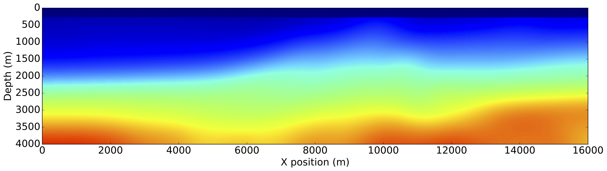

### **Devito**: Symbolic Finite Difference Computation

Devito is a Python package to implement optimized stencil computation (e.g.,
finite differences, image processing, machine learning) from high-level
symbolic problem definitions. Devito builds on [SymPy](https://www.sympy.org)
and employs automated code generation and just-in-time compilation to execute
optimized computational kernels on several computer platforms, including CPUs,
GPUs, and clusters thereof.

Symbolic computation is a powerful tool that allows users to:

* Build complex solvers from only a few lines of high-level code
* Use automated performance optimisation for generated code
* Adjust stencil discretisation at runtime as required
* (Re-)development of solver code in hours/days rather than months

<iframe width="100%" src="https://www.youtube.com/embed/druSsV_1O6w" frameborder="0" allow="accelerometer; autoplay; encrypted-media; gyroscope; picture-in-picture" allowfullscreen></iframe>

  <!--End row-->

### Seismic Inversion using Devito

Devito is primarily designed to create wave propagation kernels for
use in seismic inversion problems. A tutorial for the generation of a
modelling operator using an acoustic wave equation can be found
[here](https://nbviewer.jupyter.org/github/devitocodes/devito/blob/master/examples/seismic/tutorials/01_modelling.ipynb) and a paper
outlining the verification procedures of the acoustic operator can be
found [here](https://arxiv.org/abs/1608.08658).
 

  <!--End row-->

### Key Features

 * A functional language to express finite difference operators.
 * Straightforward mechanisms to adjust the discretization.
 * Constructs to express sparse operators (e.g., interpolation), classic linear operators (e.g., convolutions), and tensor contractions.
 * Seamless support for boundary conditions and adjoint operators.
 * A flexible API to define custom stencils, sub-domains, sub-sampling, and staggered grids.
 * Generation of highly optimized parallel code (SIMD vectorization, CPU and GPU parallelism via OpenMP and OpenACC, multi-node parallelism via MPI, blocking, aggressive symbolic transformations for FLOP reduction, etc.).
 * Distributed NumPy arrays over multi-node (MPI) domain decompositions.
 * Inspection and customization of the generated code.
 * Autotuning framework to ease performance tuning.
 * Smooth integration with popular Python packages such as NumPy, SymPy, Dask, and SciPy, as well as machine learning frameworks such as TensorFlow and PyTorch.

 

  <!--End row-->

### (Disclosed) Software using Devito

 * [JUDI](https://github.com/slimgroup/JUDI.jl) [SLIM group @GeorgiaTech]
 * Dugwave [DownUnder GeoSolutions]
 * [COFII](https://github.com/ChevronETC) [Chevron]
 * [Stride](https://www.stride.codes)
 * [xDSL](https://xdsl.dev)

  <!--End row-->

&nbsp

