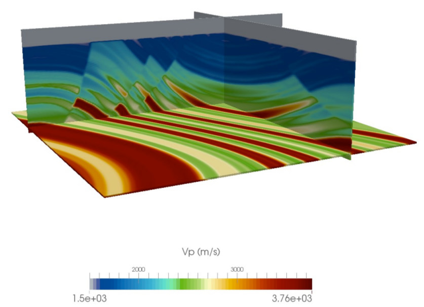
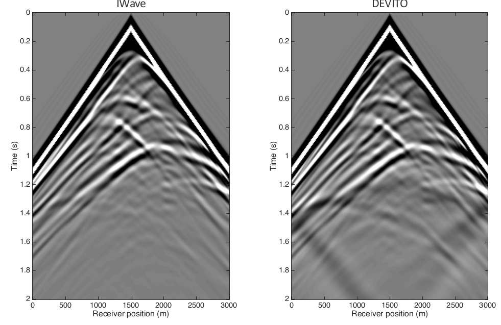

### **OPESCI**: **O**pen **P**erformance-portabl**E** **S**eismi**C** **I**maging

The OPESCI project seeks to leverage modern trends in computer science
and numerical analysis to create a high performance software framework
for subsurface imaging. The development focus is on utilising symbolic
computation and automated code generation to provide highly optimised
solver kernels for seismic inversion methods. The core aim of OPESCI
is to provide geophysicists with an infrastructure that allows rapid
research, development and deployment through the use multi-layered
abstractions while providing performance portability across a range of
many-core computer architectures.

#### **Research themes**:

* Domain-specific languages (DSL) and automatic differentiation (AD)
* Code generation for High Performance Computing (HPC)
* Stencil compilers and automated performance optimisation
* Multi-layered abstractions and performance portability

  <!--End row-->

### **Devito**

[Devito](devito) is a code generation framework that utilises
[SymPy](www.sympy.org) to generate highly optimised finite difference
solvers from high-level symbolic problem definitions. Devito was
created as part of the OPESCI project and is intended to generate wave
propagation kernels for seismic inversion workflows with very little
development effort. More information and examples can be found
[here](devito).

  <!--End row-->

### **Funding**

This OPESCI project supported by the Imperial College [Intel Parallel
Computing Center](https://software.intel.com/en-us/ipcc) in
partnership with [BG Group](http://www.bg-group.com/) in Brazil. It is
a collaborative project between [Imperial College
London](http://www.imperial.ac.uk), the [Seismic Laboratory for
Imaging and Modeling](https://www.slim.eos.ubc.ca) at The University
of British Columbia and [SENAI
CIMATEC](http://portais.fieb.org.br/senai/senai-na-sua-cidade/salvador/cimatec.html).

  <!--End row-->