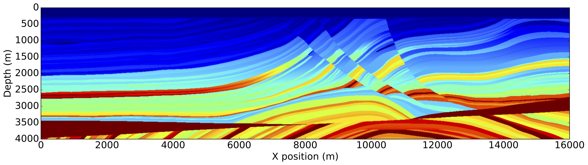
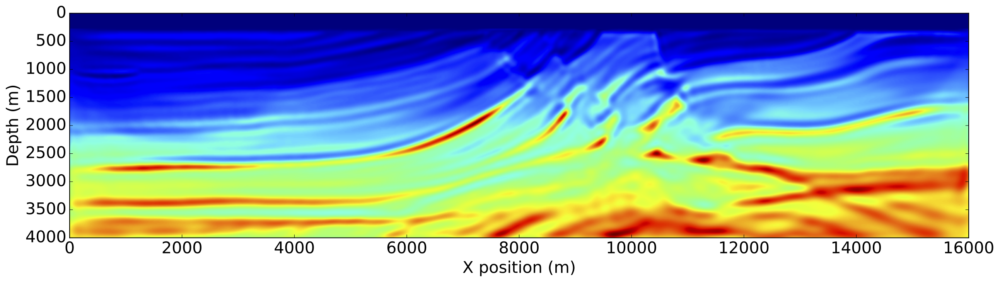
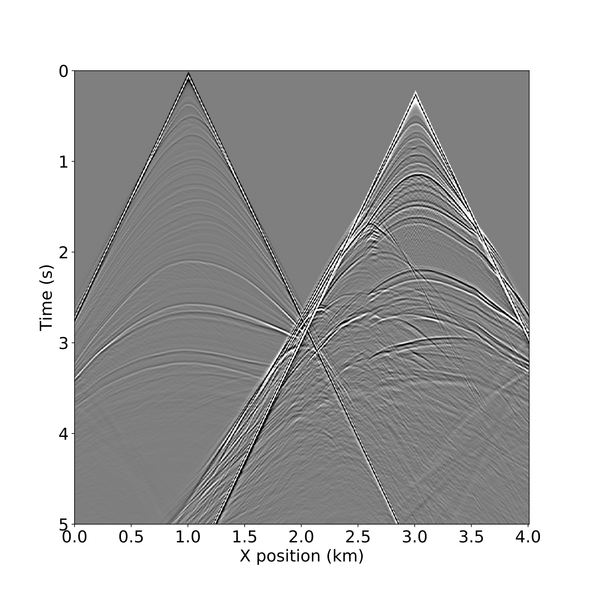

<div class="row" markdown="1">
<div class="col-sm-12 pull-left" markdown="1">
### **Devito**: Symbolic Finite Difference Computation
</div>

<div class="col-sm-6 pull-left" markdown="1">
Devito is a Domain-specific Language (DSL) and code
generation framework for the design of highly optimised finite
difference kernels for use in inversion methods. Devito utilises
[SymPy](http://www.sympy.org) to allow the definition of operators from
high-level symbolic equations and generates optimised and
automatically tuned code specific to a given target architecture.

Symbolic computation is a powerful tool that allows users to:

* Build complex solvers from only a few lines of high-level code
* Use automated performance optimisation for generated code
* Adjust stencil discretisation at runtime as required
* (Re-)development of solver code in hours rather than months

#### **Documentation**

Documentation for Devito is available
[here](https://www.devitoproject.org/devito/), including [installation
instructions](https://github.com/devitocodes/devito#devito-fast-finite-difference-computation-from-symbolic-specification), a set of
[tutorials](https://www.devitoproject.org/devito/tutorials.html) and [API
documentation](https://www.devitoproject.org/devito/userapi.html).  In addition, a paper
outlining the use of symbolic Python to define finite difference operators in
Devito can be found [here](https://arxiv.org/abs/1609.03361).  Devito is a fast
moving project so some of the documentation may lag behind development. Feel
free to talk to us on slack if you have questions - PR's are also welcome.

</div>

<div class="col-sm-1 pull-left" markdown="1"></div>
<div class="col-sm-4 pull-left" markdown="1">
```
from devito import *

grid = Grid(shape=(nx, ny))
u = TimeFunction(name='u', grid=grid,
                 space_order=2)
u.data[0, :] = initial_data[:]

eqn = Eq(u.dt, a * (u.dx2 + u.dy2))
stencil = solve(eqn, u.forward)
op = Operator(Eq(u.forward, stencil))
op(t=timesteps, dt=dt)
```

Example code for a 2D diffusion operator from a symbolic definition. The full
tutorial can be found [here](https://nbviewer.jupyter.org/github/devitocodes/devito/tree/master/examples/cfd/). To get more familiar with Devito,
we provide a wide selection of [tutorials](https://www.devitoproject.org/devito/tutorials.html).
</div>
<div class="col-sm-1 pull-left" markdown="1"></div>
</div>  <!--End row-->

<div class="row" markdown="1">
<div class="col-sm-12 pull-left" markdown="1">
### Seismic Inversion using Devito
</div>

<div class="col-sm-6 pull-left" markdown="1">
Devito is primarily designed to create wave propagation kernels for
use in seismic inversion problems. A tutorial for the generation of a
modelling operator using an acoustic wave equation can be found
[here](https://nbviewer.jupyter.org/github/devitocodes/devito/blob/master/examples/seismic/tutorials/01_modelling.ipynb) and a paper
outlining the verification procedures of the acoustic operator can be
found [here](https://arxiv.org/abs/1608.08658).
<br/>





</div>

<div class="col-sm-6 pull-left" markdown="1">

</div>
</div>  <!--End row-->

<div class="row" markdown="1">
<div class="col-sm-12 pull-left" markdown="1">
### Optimisation and Performance
</div>

<div class="col-sm-6 pull-left" markdown="1">
Devito provides a set of automated performance optimizations during code generation that allow user applications to
fully utilise the target hardware without changing the model specification:

* Vectorisation (via OpenMP)
* Shared-memory parallelism (via OpenMP), including nested parallelism and non-affine loop support
* Loop blocking, including hierarchical blocking
* Auto-tuning (e.g., block-shape, threads per parallel region)
* Symbolic optimisations:
    * Common sub-expression elimination (CSE)
    * Cross-iteration redundancy elimination (CIRE)
    * Expression hoisting
    * Factorization

Devito also supports distributed-memory parallelism via MPI. Several halo-exchange schemes are available; classic
optimisations such as computation-communication overlap (relying on asynchronous progress engine) are implemented.
</div>

<div class="col-sm-1 pull-right" markdown="1"></div>
<div class="col-sm-4 pull-right" markdown="1"></div>
<div class="col-sm-1 pull-right" markdown="1"></div>
</div>  <!--End row-->
